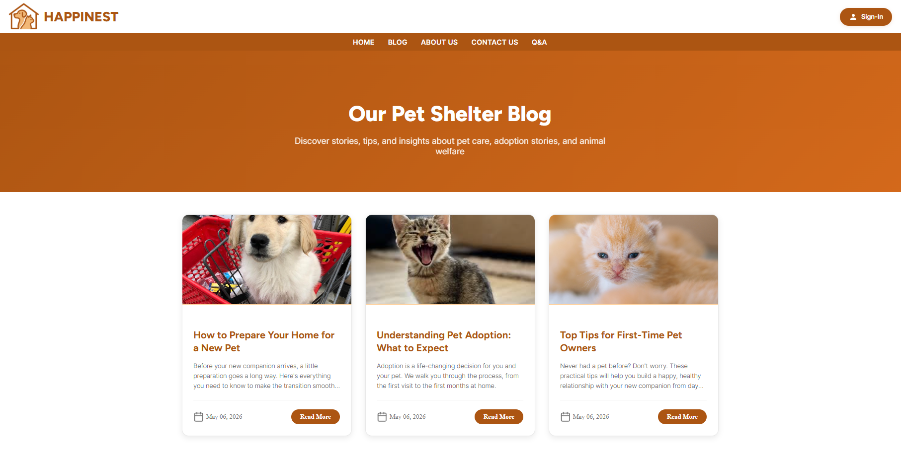

<div align="center">

# Happinest 🐾

**Web platform for animal shelters**


[](https://happinest.fly.dev/)

</div>

---



---

## Overview

Happinest is a web platform built for animal shelters. It centralizes adoption listings, volunteer coordination, foster family management, and a blog — giving shelters the tools to connect animals with people faster.

## Features

- **Adoption listings** — browse available animals with photos, descriptions, and status
- **Adoption process** — submit and track adoption requests through the platform
- **Volunteer coordination** — register as a volunteer and manage availability
- **Foster family management** — connect animals with temporary foster homes
- **Blog** — publish pet care tips, adoption stories, and animal welfare content
- **Q&A section** — answer common questions for first-time adopters
- **Authentication** — user accounts with sign-in for adopters and admins

## Stack

| Layer | Technology |
|-------|-----------|
| Framework | Laravel |
| Language | PHP |
| Database | MySQL |
| Templating | Blade |
| Hosting | Fly.io |

## Local Development

```bash
git clone https://github.com/DavidSerret/Pet-Shelter.git
cd Pet-Shelter
composer install
cp .env.example .env
php artisan key:generate
# Configure DB credentials in .env
php artisan migrate --seed
php artisan serve
```

Open [http://localhost:8000](http://localhost:8000).

## Environment Variables

```env
DB_CONNECTION=mysql
DB_HOST=127.0.0.1
DB_PORT=3306
DB_DATABASE=happinest
DB_USERNAME=
DB_PASSWORD=
```

---

<div align="center">
  <a href="https://happinest.fly.dev/">Live ↗</a> · <a href="https://github.com/DavidSerret">@DavidSerret</a>
</div>
